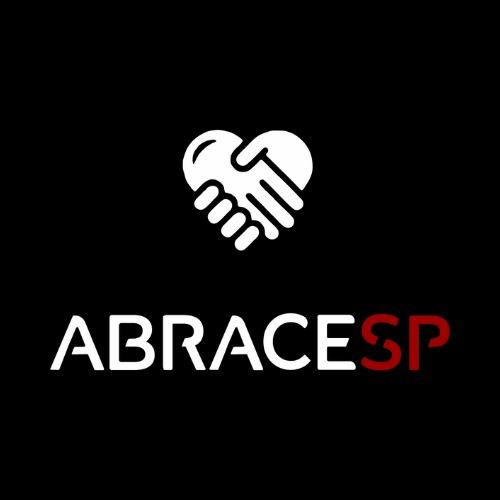

# Projeto3 - ABRACESP

## 🏫 FECAP - Fundação de Comércio Álvares Penteado

<p align="center">
<a href= "https://www.fecap.br/"></a>
</p>

## 👨‍💻 Integrantes: André dos Santos, Guilherme Fogolin, Lucas Moreira, Pedro Lemos e Yan Cezareto

## 👨‍🏫 Professores Orientadores: David de Oliveira Lemes, Francisco de Souza Escobar, Katia Milani Lara Bossi e Renata Muniz Do Nascimento

## 📄 Descrição

<p align="center">
  
</p>

Um site que permite o usuário ter acessos a diversas divulgações de serviços sociais em São Paulo, tais como ONG’s que realizam o acolhimento e doações à população, serviços de alimentação e oportunidades de cursos e capacitações. Consiste na centralização dessas informações em uma ideia tal qual um “portal de informações”.

## 🛠 Estrutura de pastas

```Raiz/
├── documentos/
│   ├── bd/
│   │   └── primeiraEntrega/
│   │   └── segundaEntrega/
│   ├── calculoII/
│   |   └── primeiraEntrega/
│   │   └── segundaEntrega/
│   └── gerais/
│       └── primeiraEntrega/
├── img/
├── src/
│   ├── Backend/
│   │   └── primeiraEntrega/
│   │   └── segundaEntrega/
│   └── Frontend/
│       └── primeiraEntrega/
│       └── segundaEntrega/
└── readme.md
```

README.MD: Arquivo que serve como guia e explicação geral sobre o projeto ABRACESP.

Além disso, há outras pastas com os devidos arquivos em cada período de entrega.

documentos: Devidos documentos do projeto, arquivos relacionados ao Banco de Dados e relações com Cálculo II.
[documentos](./documentos)

img: Reunião de imagens utilizadas no projeto.
[img](./img)

src (com backend e frontend): Pasta que contém os códigos do projeto.
[src](./src)

## 🎨 Figma
Link para o protótipo do [Figma](https://www.figma.com/proto/uvSgLKfouJ1rHC1m3e6JA7/Wireframes---ABRACESP?node-id=699-10&t=IAQbOVuR7RTnp4yq-1)!

## 💻 Configuração para Instalação

(1) Instale o Node.JS e o NPM, configurando-os nas variáveis de ambiente:
```
https://nodejs.org/pt
```
(2) Clone o repositório atual para a sua máquina:
```
https://github.com/2024-2-NCC2/Projeto3.git
```
(3) Clonado o repositório, instale as depedências necessárias para o projeto:
```
npm install
npm install @fontsource/inter@^5.1.0
npm install @fortawesome/fontawesome-svg-core@^6.6.0
npm install @fortawesome/free-brands-svg-icons@^6.6.0
npm install @fortawesome/free-regular-svg-icons@^6.6.0
npm install @fortawesome/free-solid-svg-icons@^6.6.0
npm install @fortawesome/react-fontawesome@^0.2.2
npm install @testing-library/jest-dom@^5.17.0
npm install @testing-library/react@^13.4.0
npm install @testing-library/user-event@^13.5.0
npm install bootstrap@^5.3.3
npm install react@^18.3.1
npm install react-dom@^18.3.1
npm install react-router-dom@^6.26.2
npm install react-scripts@^5.0.1
npm install react-hook-form^7.53.1
npm install styled-components@^6.1.13
npm install web-vitals@^2.1.4
```
(4) Com isso, abra o servidor no navegador que melhor te interessar:
```
npm start
```

## 📋 Licença/License

ABRACESP © 2024 by André Gregório dos Santos, Guilherme Reis Fogolin de Godoy, Lucas Moreira de Godoy, Pedro Henrique Nascimento Lemos, Yan Cezareto Ramos is licensed under CC BY-NC-ND 4.0 

## 🎓 Referências

```
1. https://www.fcc.org.br/difusao/biblioteca/biografia

2. https://www.ev.org.br/

3. https://fotografia.folha.uol.com.br/galerias/1799335716865441-d

4. https://sinpesp.com.br/

5. https://www.casaum.org/

6. https://www.caosemdono.com.br/

7. https://www.udemy.com/pt/

8. https://www.alura.com.br/

9. https://getbootstrap.com/

10. https://cheatsheets.zip/

11. https://flexboxfroggy.com/

12. https://cssgridgarden.com/

13. https://youtu.be/pNBTyMIUDew?si=IQwANCbTnxVD9lRt

14. https://youtu.be/0su3MyulVSo?si=W6i63Kz2NUDzn4i-

15. https://youtu.be/Jg6JaEjovJk?si=81m90br4tcA9vAEG

16. https://youtu.be/edDCEK5QWE8?si=1sPvfxBtzcEkSLGZ

17. https://youtu.be/BpzyuuPIEaQ?si=NzN6aPxM0iqoCftI

18. https://youtu.be/x-4z_u8LcGc?si=AF1nWxB5CaM6ibcZ

19. https://casadeisabel.org.br/

20. https://capital.sp.gov.br/web/direitos_humanos/w/mulheres/336498

21. https://www.arouchianos.com.br/mona.html

22. https://www.arouchianos.com.br/mona.html

23. https://casadoaconchego.org.br/

24. https://cadiversidade.wixsite.com/florescer

25. https://saoluiz.org.br/

26. https://www.pucsp.br/clinica/

27. https://www.ung.br/estrutura-fisica/clinica-de-psicologia

28. https://abps.com.br/

29. https://www.mackenzie.br/atendimento-a-comunidade/servico-escola-de-psicologia-mackenzie

30. https://www.desenvolvimentosocial.sp.gov.br/acoes-de-protecao-social/programa-bom-prato/

31. https://www.serasa.com.br/blog/auxilio-cesta-basica/ 

32. https://tonkiri.org.br/ 

33. https://www.paodopovodarua.com.br/ 

32. https://www.sesc.com.br/atuacoes/assistencia/sesc-mesa-brasil/ 

33. https://sebrae.com.br/sites/PortalSebrae/cursosonline 

34. https://www.ev.org.br/ 

35. https://www.dio.me/

36. https://www.atados.com.br/ong/associacao-vida-carrapicho 

37. https://www.caosemdono.com.br/

38. https://faveladapazcom.wordpress.com/ 

39. https://graacc.org.br/ 

40. https://www.fadc.org.br/

41. https://www.revistacanavieiros.com.br/uploads/tinymce/uploads/capa_2_1.gif

42. https://portalceara.jor.br/wp-content/uploads/2023/03/abrinq.jpg42

43. https://spdm.org.br/wp-
content/uploads/2022/02/867519228d1d5325856fc61d710ded0e.jpg

44. https://graacc.org.br/wp-
content/uploads/2023/01/GRAACC_Corrida2023_NoticiaSite_907x557.png

45. https://images.virgula.me/2022/06/adus-.png

46. https://i3.wp.com/adus.org.br/wp-content/uploads/2023/08/home2.jpg

47. https://th.bing.com/th/id/OIP.o0GUFWXr7H9v9YJQZz_INAHaE8?rs=1&amp;pid=ImgDetMain

48. https://adotar.com.br/adm/upload/logo_ong160.jpg

49. https://storage.googleapis.com/atados-v3/user-uploaded/images-medium/99c43798-a5fa-4ccc-9acd-929a3ddacc52.jpeg

50. https://th.bing.com/th/id/OIP.vP6pFP-eRLYcDGLvTGaIjAHaHa?rs=1&amp;pid=ImgDetMain

51. https://conteudo.imguol.com.br/c/entretenimento/da/2021/10/07/projeto-tonkiri-ajuda-comunidades-capacita-e-desenvolve-seus-lideres-em-sp-1633636861308_v2_750x421.jpg
```
