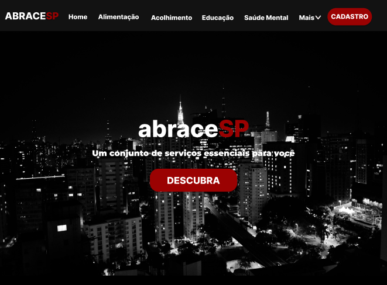

# Projeto3 - ABRACESP

## FECAP - Fundação de Comércio Álvares Penteado

## Integrantes: André dos Santos, Guilherme Fogolin, Lucas Moreira, Pedro Lemos e Yan Cezareto

## Professores Orientadores: David de Oliveira Lemes e Francisco de Souza Escobar

## Descrição

Um site que permite o usuário ter acessos a diversas divulgações de serviços sociais em São Paulo, tais como ONG’s que realizam o acolhimento e doações à população, serviços de alimentação e oportunidades de cursos e capacitações. Consiste na centralização dessas informações em uma ideia tal qual um “portal de informações”.

## 🛠 Estrutura de pastas

-Raiz

|--> bd

   |----> primeiraEntrega

|--> calculoII

   |----> primeiraEntrega

|--> documentos

   |----> arquivos

      |-----> primeiraEntrega

   |----> figma

      |------> primeiraEntrega

|--> src

   |----> Backend

      |------> primeiraEntrega

   |----> Frontend

      |------> primeiraEntrega

|readme.md

README.MD: Arquivo que serve como guia e explicação geral sobre o projeto ABRACESP.

Além disso, há outras pastas com os devidos arquivos em cada período de entrega.

bd: Pasta com arquivos relacionados ao Banco de Dados.
[bd](./bd)

calculoII: Documentações que contemplem a matéria de Cálculo II.
[calculoII](./calculoII)

documentos (com pasta arquivos e Figma): Devidos documentos e direções para o Figma.
[documentos](./documentos)

src (com backend e frontend): Pasta que contém os códigos do projeto.
[src](./src)

## 🛠 Instalação

<b>HTML:</b>

Não há instalação!
Encontre o index.html na pasta executáveis e execute-o como uma página WEB (através de algum browser).

## 💻 Configuração para Desenvolvimento

Descreva como instalar todas as dependências para desenvolvimento e como rodar um test-suite automatizado de algum tipo. Se necessário, faça isso para múltiplas plataformas.

## 📋 Licença/License

## 🎓 Referências

1.https://www.fcc.org.br/difusao/biblioteca/biografia
  

2.https://www.ev.org.br/
  

3.https://fotografia.folha.uol.com.br/galerias/1799335716865441-d
  

4.https://sinpesp.com.br/
  

5.https://www.casaum.org/
  

6.https://www.caosemdono.com.br/
  

7.https://www.udemy.com/pt/
  

8.https://www.alura.com.br/
  

9.https://getbootstrap.com/
  

10.https://cheatsheets.zip/
  

11.https://flexboxfroggy.com/
  

12.https://cssgridgarden.com/
  

13.https://youtu.be/pNBTyMIUDew?si=IQwANCbTnxVD9lRt
  

14.https://youtu.be/0su3MyulVSo?si=W6i63Kz2NUDzn4i-
  

15.https://youtu.be/Jg6JaEjovJk?si=81m90br4tcA9vAEG
  

16.https://youtu.be/edDCEK5QWE8?si=1sPvfxBtzcEkSLGZ
  

17.https://youtu.be/BpzyuuPIEaQ?si=NzN6aPxM0iqoCftI
  

18.https://youtu.be/x-4z_u8LcGc?si=AF1nWxB5CaM6ibcZ
  
